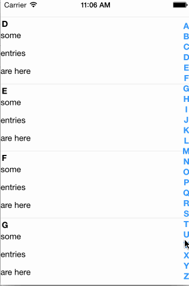
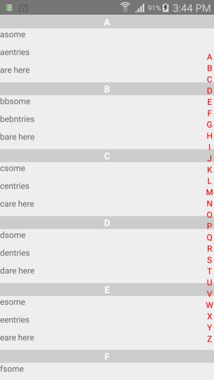

#React Native Alphabetical ListView

This is a working example project for Android and IOS.

## Setup Instructions-

1. `git clone https://github.com/bozzmob/React-Native-Alphabetical-ListView.git`
2. `cd React-Native-Alphabetical-ListView`
3. `npm install`

*If you are running on Emulator-*

4. `react-native run-android`

*If you are running on Phone-*

4. `react-native start > /dev/null 2>&1 &`
5. `adb reverse tcp:8081 tcp:8081`
6. `react-native run-android`

## Screenshots-

### Original Screenshot-

### Screenshot from the example-

## Regards

Thanks to [@johanneslumpe](https://github.com/johanneslumpe) for this amazing [project](https://github.com/johanneslumpe/react-native-selectablesectionlistview) module.

This project mainly aims at creating a readily usable project using the module.

###To Do-

- Enhance the alphabetical list view to add more features
